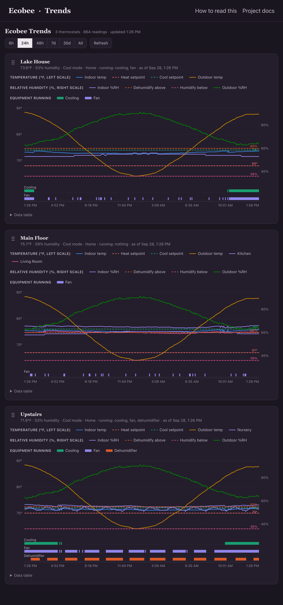
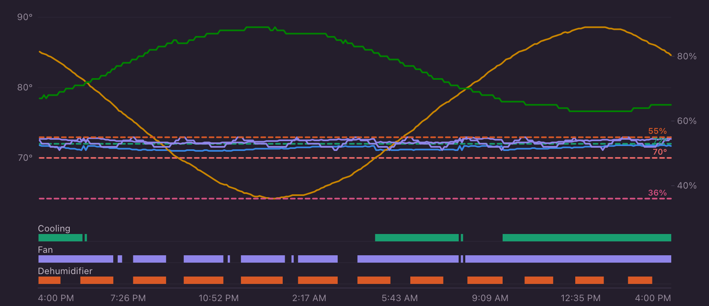

# Ecobee Trends

Self-hosted logging and charting for ecobee thermostats. Polls the ecobee API
every few minutes, stores every reading in SQLite on your own machine, and
serves an interactive dashboard that puts temperature, humidity, setpoints and
**equipment run-state on one shared timeline** — so you can see what your HVAC
actually did, not just what it's doing now.

No cloud service, no account with anyone but ecobee, no data leaves your
network unless you publish it yourself.

New to the dashboard (or to ecobee)? Start with the
**[user guide](docs/user-guide.md)**.



## Why one chart instead of three

Separate charts for temperature, humidity and equipment make you correlate by
eye across panels. Stacking them on a shared x-axis makes cause and effect
obvious. Here the dehumidifier (orange) cycles on when indoor %RH (purple)
crosses its 55% setpoint, pulls it down ~3 points, and shuts off — the sawtooth
that tells you the unit is sized right and working:



## Try it with no ecobee account

Synthetic data for three fictional thermostats, in one command:

```bash
git clone https://github.com/kwein123/ecobee-trends.git
cd ecobee-trends
./setup.sh --demo          # builds, generates demo data, opens on :8321
```

Everything above is generated by [`tools/make_demo_db.py`](tools/make_demo_db.py) —
a small physical model (diurnal outdoor curve, thermal lag, dehumidifier with
hysteresis), not a recording of anyone's home.

## Set it up for real

**You need:** Docker (Desktop or Engine), and your ecobee.com login. That's it —
no developer account, no API key registration.

```bash
git clone https://github.com/kwein123/ecobee-trends.git
cd ecobee-trends
./setup.sh
```

The script checks Docker, asks for a port and poll interval (defaults are fine),
then prompts for your ecobee email, password, and 2FA code if your account uses
it. Your password is used once to obtain OAuth tokens and is **not stored** —
only the tokens are, in `data/auth/ecobee.conf`. Then it starts both services
and prints the URL.

Charts fill in as readings accumulate: a few hours is interesting, a few days
more so.

### Everyday commands

```bash
docker compose logs -f logger    # watch it poll
docker compose ps                # status
docker compose down              # stop
docker compose up -d             # start again
```

### Rename and reorder your thermostats

ecobee's default names ("My ecobee") aren't always what you want on a chart.
Renaming is presentation-only — logged data keeps ecobee's names, so it's
reversible at any time:

```bash
docker compose exec logger python app/ecobee_units.py list
docker compose exec logger python app/ecobee_units.py rename "My ecobee" "Lake House"
docker compose exec logger python app/ecobee_units.py order "Lake House" "Main Floor" "Upstairs"
```

`order` sets the default order for everyone. Each viewer can also rearrange
the panels for themselves by dragging the dotted handle next to a
thermostat's name (touch, mouse, or keyboard ↑/↓). That order is saved in
their browser. See the [user guide](docs/user-guide.md#reordering-the-thermostats).

## Hosting it under your own site

The page ships with a small generic header. To make it match the site it's
part of, without forking or editing the code, give the dashboard a **site
folder**. Every file in it is optional:

| File | Effect |
|---|---|
| `head.html` | Inserted into the page's `<head>`, after the base theme and before the page styles: your stylesheet, favicon links. |
| `header.html` | Replaces the default header at the top of the page. |
| images, fonts, `.css` | Served at `site/<name>`, e.g. ``. |

```html
<!-- site/head.html -->
<link rel="icon" href="site/favicon.png">
<link rel="stylesheet" href="/assets/my-site.css">
```

```html
<!-- site/header.html -->
<header class="sb-site"><div class="sb-site-inner">
  <a class="sb-brand" href="/">My Site</a>
  <nav class="sb-nav"><a href="/">Home</a><a href="" class="active">Thermostats</a></nav>
</div></header>
```

Point the dashboard at it with `--site-dir ./site` (or `ECOBEE_SITE_DIR`);
in Docker, uncomment the two `site` lines in `docker-compose.yml`. Your
stylesheet can restyle everything by overriding the tokens at the top of
[`app/static/theme.css`](app/static/theme.css) (`--page`, `--surface`,
`--ink`, `--accent`, …). The page's security policy only loads files from the
dashboard's own site, so link stylesheets and images from there, not from
other domains, and don't add inline scripts or styles (they won't run).

The folder is read on every page load, so edits show up on refresh. Pin your
deployment to a release tag and branding survives upgrades untouched.

## What gets recorded

Every poll, per thermostat: HVAC mode, current program climate, **running
equipment** (fan, compressor stages, aux heat, humidifier, dehumidifier,
ventilator), indoor temperature and humidity, heat/cool setpoints,
humidify/dehumidify targets, active holds and vacations, and outdoor
conditions from ecobee's weather feed. Plus every remote sensor's temperature,
humidity and occupancy.

It's a plain SQLite file — query it directly whenever you want:

```bash
sqlite3 data/db/ecobee.sqlite3 \
  "SELECT ts_utc, name, actual_temp_f, actual_humidity, equipment_status
   FROM thermostat_readings ORDER BY ts_utc DESC LIMIT 10;"
```

## Architecture

```
ecobee cloud API
      ▲  OAuth2 refresh-token auth, outbound only
      │  every POLL_INTERVAL seconds
┌─────┴──────────┐  writes   ┌──────────────────┐  reads   ┌───────────────────┐
│ logger         ├──────────►│ SQLite (WAL)     │◄─────────┤ dashboard :8321   │
│ (container)    │           │ data/db/         │ read-only│ (container)       │
└────────────────┘           └──────────────────┘          └───────────────────┘
      ▲ mounts data/auth/ (tokens)                    ▲ mounts data/db/ only
```

Two containers from one image. The **token file is mounted only into the
logger** — the web-facing container has no path to your ecobee credentials even
if it were fully compromised. The dashboard is GET-only and opens the database
read-only; there is no request a browser can make that reaches the ecobee API.

More detail: [docs/architecture.md](docs/architecture.md) ·
[docs/security.md](docs/security.md) — including what to consider before
putting a dashboard like this on the public internet.

## Requirements

- Docker with Compose v2 (`docker compose version`)
- An ecobee account (any thermostat the account can see is logged)
- ~50 MB disk per thermostat-year at the default 5-minute interval

Runs on x86-64 and ARM (tested on a Raspberry Pi 4). Python 3.12 in the
container; the only third-party dependency is `requests`.

## Running it without Docker

```bash
pip install -r requirements.txt
python app/ecobee_login.py                    # writes data/auth/ecobee.conf
python app/ecobee_logger.py --interval 300 &  # appends to data/db/ecobee.sqlite3
python app/ecobee_dashboard.py
```

Run these from the repository root; the default paths are relative to it.
`ECOBEE_CONFIG` and `ECOBEE_DB` override them.

## Tests

```bash
python -m unittest discover -s tests       # Python: API, logger, CLI, HTTP server
node --test tests/js/*.test.js             # chart and reorder logic
node --test tests/browser/*.test.mjs       # real touch input in headless Chrome
```

The browser tests drive a phone-emulated Chrome with genuine touch events,
because reordering by finger is exactly what mouse-only tests miss. They
need Chrome or Chromium (`CHROME_PATH` if it isn't found) and skip without
it. CI runs all three, plus the Python tests inside the Docker image.
`node tools/screenshots.mjs` regenerates the images in `docs/img/` from the
demo data.

## Credits and license

Built by **Kevin Weinrich — [Sweetbriar Computing](https://sweetbriarcomputing.com)**.

Developed in collaboration with **Claude** (Anthropic): architecture,
implementation and review were done as a human-directed pair-programming
exercise, with design decisions, verification and deployment choices made by
the author. Commits are co-authored accordingly.

The bundled `pyecobee/` package is
[python-ecobee-api](https://github.com/nkgilley/python-ecobee-api) by Nolan
Gilley and contributors (MIT). That includes its web/OAuth login flow with
two-factor support, contributed upstream by JJTech0130, MizterB and pike00.
It is vendored from upstream version 0.4.1 with one local change: the token
file is written atomically, so a crash mid-write can't destroy the only copy
of a rotating refresh token (see `pyecobee/util.py`).

MIT licensed — see [LICENSE](LICENSE).

*Not affiliated with or endorsed by ecobee Inc. "ecobee" is their trademark.*
