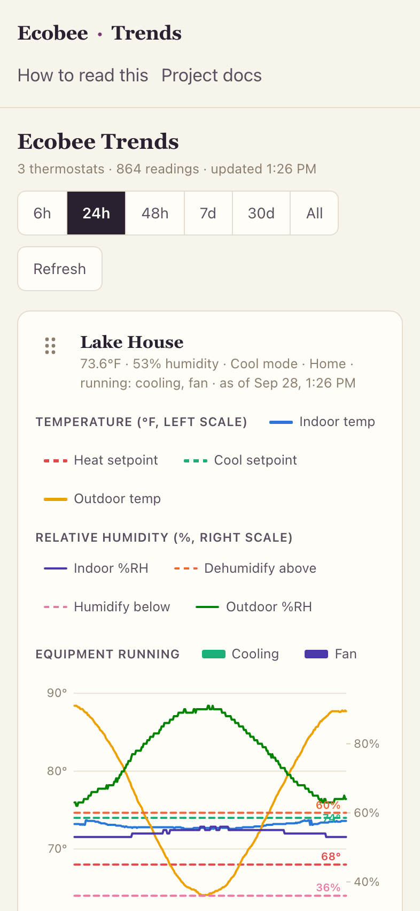
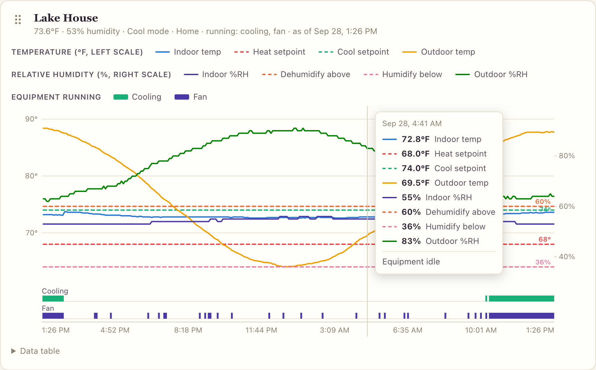
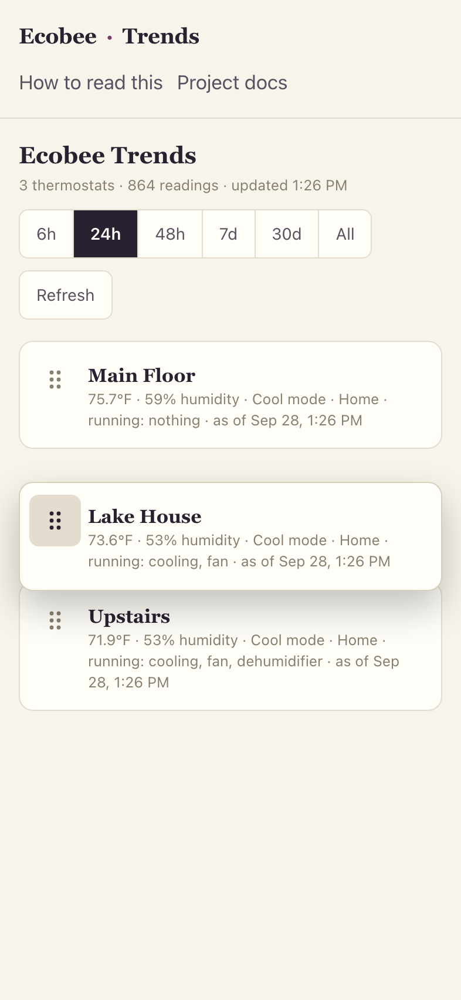

# Ecobee Trends: a guide to reading the dashboard

This guide is for anyone looking at an Ecobee Trends page for the first
time, including people who have never used an ecobee thermostat. It covers
what the page shows, how to read the charts, and how to spot the patterns
worth noticing.

**Contents:**
[The short version](#the-short-version) ·
[A one-minute ecobee primer](#a-one-minute-ecobee-primer) ·
[A tour of the page](#a-tour-of-the-page) ·
[Reading a chart](#reading-a-chart) ·
[Getting exact numbers](#getting-exact-numbers) ·
[Hiding lines](#hiding-and-showing-lines) ·
[Reordering thermostats](#reordering-the-thermostats) ·
[Time ranges](#time-ranges-and-averaging) ·
[Patterns worth recognizing](#patterns-worth-recognizing) ·
[Glossary](#glossary) ·
[Questions and troubleshooting](#questions-and-troubleshooting)

## The short version

- Each box on the page is **one thermostat** and its recent history.
- **Solid lines** are measurements (how warm or humid it actually was).
  **Dashed lines** are targets (what the thermostat was trying to achieve).
- The **colored bars under each chart** show when equipment (cooling,
  heating, the fan, a dehumidifier) was running.
- **Point at a chart** (hover with a mouse, or touch it on a phone) to read
  the exact values at that moment.
- The page is **read-only**. Nothing you do here changes a thermostat.

## A one-minute ecobee primer

An **ecobee** is a smart thermostat: the control on the wall that tells a
building's heating and cooling equipment when to run. It measures the
temperature and humidity where it hangs, and some homes add small
**remote sensors** in other rooms.

Every few minutes the thermostat reports to ecobee's servers. This project
asks those servers for the latest readings every 5 minutes, saves them, and
draws them here. ecobee's own app shows you *now*. This page shows you *what
happened*: hours, days or months of it on one timeline.

Terms you'll see on the page:

- **Setpoint:** the target temperature. A thermostat usually has two: a
  **heat setpoint** (turn heat on if it gets colder than this) and a **cool
  setpoint** (turn cooling on if it gets warmer than this). Between the two,
  nothing needs to run.
- **Mode:** which of those the thermostat is allowed to act on: *Heat*,
  *Cool*, *Auto* (either, as needed), or *Off*.
- **Comfort setting:** ecobee's name for a scheduled set of setpoints, such
  as *Home*, *Away* or *Sleep*. The schedule switches between them during
  the day, which is why target lines often step up and down at the same
  times each day.
- **Relative humidity (RH):** how much moisture is in the air, as a
  percentage of the most it could hold at that temperature. Indoors, roughly
  30–60% is the usual comfortable range.

The [glossary](#glossary) covers the rest.

## A tour of the page

From the top:

1. **Status line** (under the title): how many thermostats there are, how
   many readings are in the current view, and when the page last fetched
   data. The page refreshes itself every 5 minutes while it's open.
2. **Time range buttons:** `6h`, `24h`, `48h`, `7d`, `30d`, `All`. They set
   how far back the charts go. See [Time ranges](#time-ranges-and-averaging).
3. **Refresh:** fetches the newest readings right away.
4. **One panel per thermostat.** Each panel's header shows:
   - its **name**
   - its latest **temperature** and **humidity**
   - its **mode** and current **comfort setting**
   - **what's running** right now
   - **when** that reading was taken

   Hover over the name to see what the thermostat is called in the ecobee
   app, if it's been renamed here.

Two warnings can appear under a panel's header:

- **"No new readings since …"** means nothing new has arrived for over 30
  minutes. Usually the logging service on the server has stopped, or the
  internet connection dropped. The last known values stay on screen.
- **"Thermostat is offline"** means ecobee's servers report they can't
  reach the thermostat itself (for example, its Wi-Fi is down).

## Reading a chart

Time runs left to right, with the newest readings at the right edge.

The key rows above the chart name every line. Solid lines are measurements
and dashed lines are targets.

**Temperature** uses the **left scale** (°F):

| Line | Meaning |
|---|---|
| Indoor temp (solid) | The temperature the thermostat reports. With remote sensors this can be an average of several rooms. |
| Heat setpoint (dashed) | Heating starts if the indoor temperature falls below this. |
| Cool setpoint (dashed) | Cooling starts if the indoor temperature rises above this. |
| Outdoor temp (solid) | ecobee's weather report for the thermostat's area. It comes from a weather service, not a sensor on the building. |
| Room names (solid, when present) | Each remote sensor's own temperature, e.g. "Kitchen". |

**Humidity** uses the **right scale** (%):

| Line | Meaning |
|---|---|
| Indoor %RH (solid) | Indoor relative humidity. |
| Dehumidify above (dashed) | The dehumidifier target, if there is one. It runs when humidity goes above this. |
| Humidify below (dashed) | The humidifier target, if there is one. It runs when humidity drops below this. |
| Outdoor %RH (solid) | ecobee's weather report for outdoor humidity. |

A few more details:

- **Small numbers at the right end of the dashed lines** (like `74°` or
  `60%`) give each target's latest value. Targets are flat lines that can
  sit close together, so the label tells you which is which. The `°` or `%`
  sign also tells you which scale the line belongs to.
- **Equipment strips** below the chart show when each piece of equipment
  ran. A solid bar means it was running. At longer time ranges, a paler bar
  means it ran for only part of that stretch (see
  [averaging](#time-ranges-and-averaging)).
- **Gaps** in a line mean no readings were recorded for that stretch (for
  example, the logger or the internet was down). The chart leaves a gap
  rather than guessing at the values.

## Getting exact numbers

The chart shows the shape; to see the numbers at a particular moment:

- **With a mouse:** hover over the chart. A vertical line marks the moment,
  and a box lists every value and what was running.
- **On a phone or tablet:** touch the chart. Slide your finger **sideways**
  to move through time. Swiping **up or down** still scrolls the page as
  usual. The box stays up after you lift your finger; tap anywhere else to
  close it.
- **With a keyboard:** press Tab until the chart is highlighted, then use the
  **←** and **→** arrow keys. Press **Esc** to close the box.

Each panel also has a **Data table** link at the bottom. It opens a table of
the most recent readings (newest first), with the same numbers the chart
draws. This is also the most accessible way to read the data with a screen
reader.

## Hiding and showing lines

Every entry in the key rows is a button. Click or tap one to hide that line
(the entry fades and is struck through); do it again to bring the line back.

- The scales adjust to fit whatever is still showing. Hiding outdoor
  temperature, for example, stretches the indoor lines so small changes are
  easier to see.
- Your choices are saved for each thermostat **in this browser only**.
  Another phone or computer keeps its own.

## Reordering the thermostats

You can put the thermostats in whatever order you like.

- **On a phone or tablet:** press and hold the **dotted handle** (⠿) to the
  left of a thermostat's name, and drag up or down. While you drag, every
  panel shrinks to its title bar so they all fit on screen. If you drag near
  the top or bottom edge, the page scrolls for you. Let go to drop it, and
  the panels open back up.
- **With a mouse:** drag the dotted handle, or drag the panel's title area.
- **With a keyboard:** Tab to the dotted handle and press **↑** or **↓** to
  move that thermostat one place at a time.

The order is remembered **in this browser**, so your phone and your
computer can each have their own. To change what a thermostat is *called*,
ask whoever runs the dashboard. Renaming is done on the server (see the
[README](../README.md#rename-and-reorder-your-thermostats)).

## Time ranges and averaging

| Button | Shows | Detail |
|---|---|---|
| 6h, 24h, 48h | the last 6, 24 or 48 hours | every reading (normally one every 5 minutes) |
| 7d | the last week | averages per 15 minutes |
| 30d | the last month | averages per hour |
| All | everything ever recorded | averaged so the chart stays quick, e.g. per few hours for a few months of history |

Longer ranges are **averaged**, because a month has over 8,000 readings per
thermostat, more than a chart (or a phone) can usefully show. When a range
is averaged, the status line says so (e.g. "averaged per 15 min"):

- **Temperatures and humidity** are averaged over each stretch, so short
  spikes are smoothed out. Switch to a shorter range to see them.
- **Targets** show the value in effect at the end of each stretch.
- **Equipment** shows the *share of time* it ran. In the pop-up box that
  reads like "Fan 35%", and the bar is paler the smaller the share. A brief
  run still shows up as a faint mark rather than disappearing.

## Patterns worth recognizing

You don't need to be an HVAC expert to get something out of these charts.
Some common shapes:

- **Indoor temperature hugging a target line.** This is the system doing
  its job. In cooling season, indoor temperature rises to just above the
  cool setpoint, cooling runs, and it drops back. That makes a gentle
  sawtooth, with cooling bars lined up under each downstroke.
- **Target lines stepping at the same times each day.** That's the schedule
  switching comfort settings, e.g. a cooler *Sleep* setting overnight and
  *Home* during the day.
- **A humidity sawtooth with dehumidifier bars.** Humidity creeps up to the
  "dehumidify above" line, the dehumidifier runs, humidity drops a few
  points, and it stops. A steady, regular sawtooth means it's keeping up.
  ([Example in the README](../README.md#why-one-chart-instead-of-three).)
- **The fan running on its own.** Many systems run the fan alone for a few
  minutes an hour to circulate air (ecobee calls this "fan minimum on
  time"). That shows up as short fan bars with nothing else running.
- **Indoor temperature following outdoor temperature.** Some drift with the
  weather is normal, especially in rooms with big windows. The remote
  sensor lines show which rooms swing the most.

Some patterns deserve a closer look. None of them proves a fault, but each
is worth mentioning to whoever maintains the system:

- **Equipment running nonstop while indoor temperature drifts away from the
  target.** The system can't keep up. That's expected during extreme
  weather; if it happens on mild days, have the system checked.
- **Many very short cooling or heating bars in a row** (on and off every few
  minutes). HVAC technicians call this *short cycling*, and it's worth
  having checked.
- **Humidity well above the "dehumidify above" line with no dehumidifier
  bars.** Either the dehumidifier isn't running, or it isn't wired to the
  thermostat.
- **Large, lasting differences between rooms** (remote sensor lines far
  apart). That's usually about airflow or insulation rather than the
  thermostat.

## Glossary

- **Auto (mode):** the thermostat heats or cools, whichever is needed, to
  stay between the two setpoints.
- **Auxiliary ("aux") heat / Heat (stg 2, 3):** backup or extra heating
  stages. With a heat pump, aux heat is often electric resistance heat,
  which works well but costs more to run.
- **Compressor / Cooling:** the part of an air conditioner or heat pump that
  does the cooling. "Cooling (stg 2)" is a second, stronger stage on
  systems that have one.
- **Comfort setting:** a named set of setpoints (*Home*, *Away*, *Sleep*, or
  custom ones) that the thermostat's schedule switches between.
- **Dehumidifier / Humidifier:** equipment that removes or adds moisture.
  Only shown if the thermostat controls one.
- **Economizer / Ventilator:** equipment that brings in outside air, either
  for free cooling or for fresh air.
- **Emergency heat:** a mode that uses only the backup heat, typically when
  a heat pump isn't working.
- **Fan:** the blower that moves air through the ducts. It runs whenever
  heating or cooling runs, and sometimes on its own.
- **Heat pump:** equipment that heats (and usually cools) by moving heat
  rather than burning fuel.
- **Hold:** a temporary override of the schedule, e.g. someone changed the
  temperature on the thermostat by hand.
- **Relative humidity (%RH):** moisture in the air as a percentage of the
  maximum the air could hold at that temperature.
- **Remote sensor:** a small ecobee sensor placed in another room; its
  temperature appears as its own line named after the room.
- **Setpoint:** a target value the thermostat works toward.

## Questions and troubleshooting

**The numbers are slightly different from the ecobee app.**
They come from the same source, but readings here are taken every 5 minutes
(and averaged at longer ranges), while the app shows the latest moment.
Small differences are normal.

**A panel says "No readings in the last 6 hours".**
The thermostat hasn't reported during that window. Choose a longer range to
see its last known history, and check the warning in its header.

**The status line says "Couldn't refresh".**
The page couldn't reach its server just then. The charts keep showing the
last data they received; press **Refresh** or wait for the next automatic
refresh.

**My phone and my computer show the thermostats in different orders.**
That's by design: the order (and which lines are hidden) is saved in each
browser separately.

**Can I change the thermostat from here?**
No. This page only reads history. Use the thermostat itself or the ecobee
app to change settings.

**Where does the data live? Who can see it?**
The readings are stored on the computer that runs the dashboard, not by any
third party besides ecobee itself. Thermostat serial numbers are never sent
to the page. If the dashboard is on the public internet, anyone with the
link can see the charts. See [security.md](security.md) for what that means
and how to limit it.
